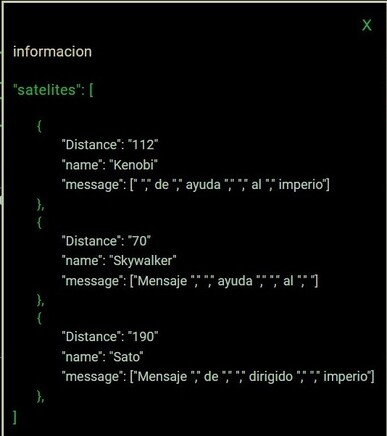
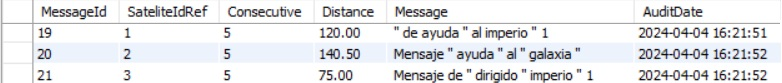

# Plan de comunicaciones base espacial.

### Pre-requisitos 📋
* Angular 16
* .net 6
* Visual Studio code
* Visual Studio
* Clonar la rama "local", en esta se ha configurado el entorno de desarollo local.

### Instalación 🔧

Abrir un consola de comandos en la ruta de la carpeta FrontEnd, ejecutar el comando **npm install**

En Visual Studio ejecutar el archivo **intersectMessage.sln**

### Introducion al problema 🚀

Tenemos una nave del imperio que pretende enviar un mensaje a tres satélites, encriptado en el siguiente formato:
#### img 1

  Puede notar que cada satélite recibe el mensaje de manera diferente,  y se guarda de la misma forma en base de datos.

#### img 2 

Los satélites (Kenobi, Skywalker:, Sato) ya tienen su respectiva información, la cual es la posición en el eje X y el eje Y.

* Kenobi: [-500, -200] sateliteIdRef 1
* Skywalker: [100, -100] sateliteIdRef 2
* Sato: [500, 100] sateliteIdRef 3

### El problema 

Se necesita saber las cordenadas X y Y de la nave del imperio.

### Solución

Una vez enviado el mensaje, se consulta la información de cada satélite en base de datos (img 2), y usamos esta para obtener la distancia y el mensaje encriptado.

Mediante la información que se tiene de la posición de los satélites, y la distancia del mensaje que llega a cada uno, usamos el sistema de trilateración y distancias (sistema de ecuaciones matemáticas), para poder hallar la ubicación del la nave imperial.

Para desencriptar el mensaje utilizamos la información encriptada en los 3 satélites, y por medio de los diferentes métodos que tiene c# para manejar cadenas, se logra descifrar el mensaje y una vez hecho esto el mensaje se guarda en la base de datos para asi mostrala en la sección de la consola rebelde.

